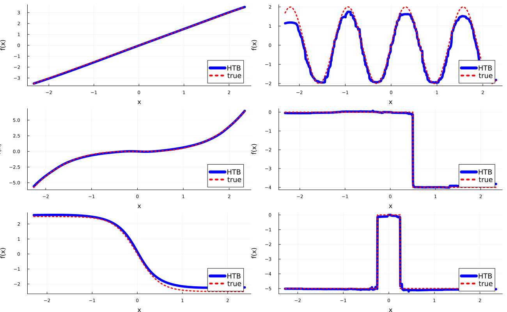

# HTBoost

**Logo here !!!!**

[](https://github.com/PaoloGiordani/HTBoost.jl/actions)

Documentation:
[docs-url]: https://paologiordani.github.io/HTBoost.jl 

## Data efficient boosting with hybrid trees 

A Julia implementation of Hybrid Trees Boosting as described in [HTBoost paper](provide link!!) 

HTBoost attempts to eliminate or mitigate some limitations of standard boosted trees in dealing with smooth and partially smooth functions. HTBoost is slower than other boosting packages, but the use of hybrid trees (an evolution of the smooth trees in [SMARTboost](https://github.com/PaoloGiordani/SMARTboost.jl)) delivers superior accuracy in many situations, making them a promising tool, particularly when data is limited or very noisy. The [papers](##References), examples, and tutorials document instances in which HTBoost matches the performance of other GBMs with less than 20% of the data.  

## Installation
Latest:

```markdown
pkg> add "https://github.com/PaoloGiordani/HTBoost.jl"    
```

## For R and Python 

I am working on solutions for R and Python users. Coming soon ... 

## Documentation 

- [Parameters](docs/src/Parameters.md)
- [API](docs/src/JuliaAPI.md)
- [Tutorials (including comparison with LightGBM)](docs/src/Tutorials.md) 
- [Examples (including comparison with LightGBM)](docs/src/Examples.md) 

## Minimal example 

```julia

# set desired number of workers for parallelization and load HTBoost on all workers
number_workers  = 8      
using Distributed
nprocs()<number_workers ? addprocs( number_workers - nprocs()  ) : addprocs(0)
@everywhere using HTBoost

using Random 

# define data-generating-process and simulate data  
n,p    = 1_000,6
stde   = 1.0

f_1(x,b)    = @. b*x + 1 
f_2(x,b)    = @. 2*sin(2.5*b*x)  
f_3(x,b)    = @. b*x^3
f_4(x,b)    = @. b*(x < 0.5) 
f_5(x,b)    = @. b/(1.0 + (exp(4.0*x )))
f_6(x,b)    = @. b*(-0.25 < x < 0.25) 

b1,b2,b3,b4,b5,b6 = 1.5,2.0,0.5,4.0,5.0,5.0

x = randn(n,p)
f = f_1(x[:,1],b1)+f_2(x[:,2],b2)+f_3(x[:,3],b3)+f_4(x[:,4],b4)+f_5(x[:,5],b5)+f_6(x[:,6],b6)
y = f + stde*randn(n)

# set up HTBparam and HTBdata, then fit and predit
param  = HTBparam(loss=:L2)       
data   = HTBdata(y,x,param)

output = HTBfit(data,param)
yf     = HTBpredict(x_test,output)  

```

### Minimal example with n = 1_000


### Minimal example with n = 10_000


### Minimal example with n = 100_000


## Main features and advantages of HTBoost 

- Hybrid trees build on smooth trees, which are more accurate than standard trees if f(x) is smooth wrt at least some of the features, but can escape local minima that occasionally trap boosted smooth trees. See [Hybrid Trees](docs/src/examples/Hybrid%20trees.jl).
- Hybrid trees also refine each tree with a modified single-index model, which allows them to more efficiently capture some types of data on which standard trees struggle. See [PPR](docs/src/examples/Projection%20pursuit%20regression.jl). For more on when HTBoost can be expected to outperform other GBMs, see [Outperforming other GBM](docs/src/Outperforming%20other%20GBM.md).
- Ease of use: a parsimonious cross-validation of the most important parameters is performed automatically if modality = :compromise or :accurate, while modality = :fast and :fastest fit just one model at default parameters.
- Adapts to both dense and sparse settings. Unless n/p is large, one of the parameters being cross-validated is a sparsity-inducing penalization, which can result in more aggressive variable selection compared to standard boosting.
- Additional coefficients (e.g. overdispersion for gammaPoisson, shape for Gamma, dof for t) are estimated internally by maximum likelihood; no user's input or cv required.
- The exact loss function is typically evaluated, instead of using a quadratic approximation as in other GBMs. This contributes to improved accuracy with small n or low SNR.
- Very efficient at dealing with missing values internally.
- Ideal for time series and longitudinal data (aka panel data).
- Improved inference for Huber and t loss. 
- Available loss functions cover most cases for regression, classification (binary and multi), count data, zero-inflated data.
 
## Main limitations of HTBoost 

- Slower training than other packages for GBMs.
- Deep trees are particularly slow.
- Memory intensive in the current implementation. 

## Recommended workflow 

Start exploratory analysis with modality = :fast (or even :fastest unless the sample is very small),
then switch to modality = :compromise (default) or :accurate for best accuracy. 

```
param  = HTBparam(modality=:fastest)       
data   = HTBdata(y,x,param)
output = HTBfit(data,param)
```

See [speeding up HTBoost](docs/src/tutorials/Faster%20large%20n.md) for suggestions on how to handle large n if computing time becomes a constraint.
## Help improve HTBoost 

- If you have a dataset in which HTBoost does not outperform other GBMs (particularly if *HTBweightedtau( )* suggests it should, see [Basic use](docs/src/tutorials/Basic%20use.md)), and you have read [Outperforming other GBM](docs/src/Outperforming%20other%20GBM.md), please get in touch with me at paolo.giordani@bi.no
- Suggestions are welcome.

## 

## References


## Licence ?????? Apache 2 for CatBoost, EvoTrees and H2O, MIT for LightGBM

... Apache something about patent rights ...

© Paolo Giordani, 2024. Licensed under the Apache License, Version 2.0. See LICENSE file for more details.

