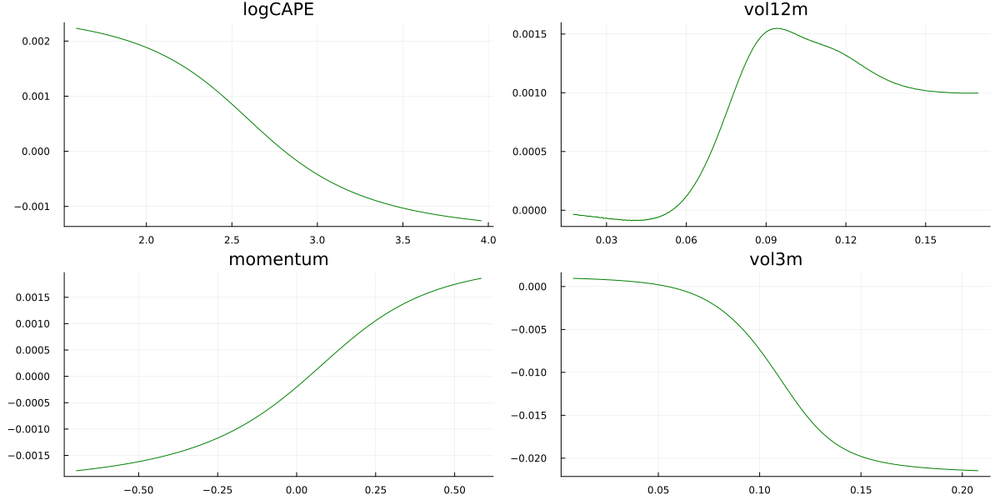

## Time series and panels

### Working with time series and longitudinal data (panels). Data as DataFrame.

The user only needs to provide features and, optionally, a vector of dates in *HTBdata( )* and, if there is overlapping, the overlap parameter in *HTBparam()*.
  Example:
```julia 
param  = HTBparam(overlap=20)        
data   = HTBdata(y,x,param,dates,fnames = fnames)
```
where *y*,*x* and *dates* can be regular vectors and matrices or dataframes, e.g.

```julia 
y = df[:,:excessret]
features = [:logCAPE, :momentum,:vol3m,:vol12m ]
x = df[:,features]
dates = df[:,:date]  
```

There is no need to specify *dates* for an individual time series. For a panel, *dates* is required for correct default block-cv (but not if user-specified train and test samples are provided in indtrain_a and indtest_a).

Overlap defaults to 0. Typically overlap = h-1, where y(t) = Y(t+h)-Y(t) (e.g. Y a log price and h=20 for monthly financial returns from daily data). This is used for purged-CV and to calibrate the priors.

By default, HTBoost uses block-cv, which is suitable for time series and longitudinal data. 
Another good alternative for times series and panels is expanding window cross-validation, which requires the user to provide indtrain_a and indtest_a in *HTBparam( )*.
The function *HTBindexes_from_dates()* can assist in building these indexes.
Example:

```julia 
first_date = Date("2017-12-31", Dates.DateFormat("y-m-d"))
indtrain_a,indtest_a = HTBindexes_from_dates(df,:date,first_date,12)  # 12 periods in each block, starting from first_date

```
See [API](../../Julia%20API.md) for more details.   
The code below provides an application to forecasting international stock market indexes. 

```julia

# On multiple cores
number_workers  = 8  # desired number of workers
using Distributed
nprocs()<number_workers ? addprocs( number_workers - nprocs()  ) : addprocs(0)
@everywhere using HTBoost

using Random, Plots, CSV, DataFrames, Statistics

Random.seed!(1)

```

If we work with log returns, :L2 (or perhaps :t) is a natural loss.  
If we work with raw returns P(t)/P(t-1), :L2loglink is an interesting alternative.  

```julia

# data 
log_ret        = false    # true to predict log returns, false (default) to predict returns
overlap        = 0        

```


```julia
loss       = :L2loglink  # if log_ret=false, consider :L2loglink instead of :L2 
modality   = :accurate    # # :accurate, :compromise, :fast, :fastest

# Specify cv 
cv_type     = "block"  # "block" or "expanding" or "randomized" (not recommended for time series and panels)
nfold       = 4        # number of folds for cv (default 4). Irrelevant if cv_type = "expanding".

# for cv_type = "expanding" 
cv_first_date     = 197001   # start date for expanding window cv       
cv_block_periods  = 120      # number of periods (months in this dataset): if cv_type="block", this is the block size

# END USER'S OPTIONS

df = CSV.read("examples/data/GlobalEquityReturns.csv", DataFrame, copycols = true) # import data as dataframe. Monthly LOG excess returns.
#display(describe(df))        

# prepare data 
log_ret ? y = 100*df[:,:excessret] : y  = @. 100*(exp(df[:,:excessret]) )

features_vector = [:logCAPE, :momentum, :vol3m, :vol12m ]
fnames = ["logCAPE", "momentum", "vol3m", "vol12m" ]

x      = df[:,features_vector]

# set up HTBparam and HTBdata, then fit, depending on cross-validation type

if cv_type == "randomized"
  param  = HTBparam(nfold=nfold,overlap=overlap,loss=loss,modality=modality,randomizecv=true) 
elseif cv_type == "block"   # default 
  param  = HTBparam(nfold=nfold,overlap=overlap,loss=loss,modality=modality) 
elseif cv_type == "expanding"
  indtrain_a,indtest_a = HTBindexes_from_dates(df,:date,cv_first_date,cv_block_periods)
  param  = HTBparam(nfold=nfold,overlap=overlap,loss=loss,modality=modality,
                     indtrain_a=indtrain_a,indtest_a=indtest_a)
end 

data   = HTBdata(y,x,param,df[:,:date],fnames = fnames)
output = HTBfit(data,param)

yhat   = HTBpredict(x,output)  # in-sample fitted value.

println("\n modality=$(param.modality), cv=$(cv_type), depth = $(output.bestvalue), number of trees = $(output.ntrees) ")
println(" in-sample R2 = ", round(1.0 - sum((y - yhat).^2)/sum((y .- mean(y)).^2),digits=3) )

fnames,fi,fnames_sorted,fi_sorted,sortedindx = HTBrelevance(output,data);

```

The output is   

```markdown

modality = :accurate, cv="block", depth = 6, number of trees = 76
 in-sample R2 = 0.017

Feature relevance, sorted from highest to lowest, adding up to 100

   logCAPE    47.954
  momentum    26.725
    vol12m    25.320
     vol3m     0.000

```

Partial dependence plots help visualize the model's fit. (However, they don't capture interactions). The marginal effect of higher valuations and volatility is to reduce expected returns, while positive momentum increases them. 

```julia

# partial dependence plots, best four features. q1st is the first quantile. e.g. 0.01 or 0.05
q,pdp  = HTBpartialplot(data,output,sortedindx[[1,2,3,4]],q1st=0.01,npoints = 5000)

# partial dependence plots
pl = Vector(undef,4)

for i in 1:4 
  pl[i]   = plot(q[:,i],pdp[:,i], legend=false,title=fnames[sortedindx[i]],color=:green)
end 

display(plot(pl[1],pl[2],pl[3],pl[4], layout=(2,2), size=(1200,600))) 

```



