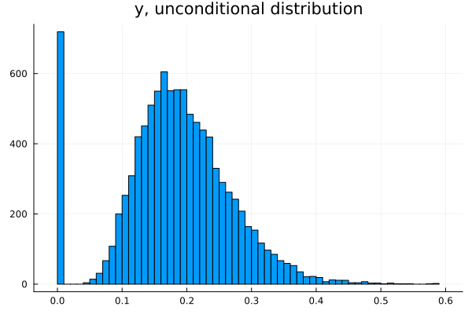

## Strategies for zero-inflated data



We distinguish three cases of zero-inflated data:  
1) A discrete distribution whose support includes 0 (e.g. Poisson) has excess probability mass at *y*=0. 
2) An otherwise continuous distribution for *y* on (0,∞) has positive mass at *y*=0.
3) An otherwise continuous distribution for *y* on (-∞,∞) has positive mass at *y*=0 or at some other value. 

**Case 1): zero-inflated discrete *y***

I am not aware of any GBM package with a specialized loss for this case, but the statistical literature has several approaches that could be adapted to GBMs. Meanwhile, for HTBoost users, loss = :gammaPoisson is an option, with loss = :hurdleL2loglink (see case 2) a possible alternative.

**Case 2): zero-inflated continuous *y* on [0,∞)**

LightGBM, XGBoost and CatBoost propose the Tweedie loss for this case. The Tweedie loss allows (for the key parameter in the rage (1-2), with default set at 1.5) for positive mass at *y*=0, where otherwise *y*>0.  
HTBoost has two loss functions specific to this case:
    ```:hurdleGamma, :hurdleL2loglink```
The :hurdleGamma is closest to the Tweedie distribution in LightGBM, XGB, and CatBoost. The hurdleL2loglink loss can be a strong alternative, if the gamma assumption is incorrect.

Hurdle models in HTBoost build two separate models, one with logistic loss to predict
the occurence of a zero, and a second model with loss gamma or L2 or L2loglink to predict
E(*y*|*y*≠0). Compared to a Tweedie regression, hurdle models have richer parametrization but
far weaker constraints on the distribution, implying higher variance and smaller bias.
My reading of the statistical literature is that hurdle model typically outperform Tweedy in terms of
forecasting, particularly in data-rich environments, which should be the most relevant case for ML.  

**Case 3): zero-inflated continuous *y* on (-∞,∞)**  
While :hurdleGamma and :hurdleL2loglink require y≥0, a :hurdleL2 loss can be used if
some y are negative. A hurdleL2 loss could therefore also be used if an otherwise continuous
y has positive mass at some value v other than zero, by setting *y* <- *y-v* and loss = :hurdleL2.  


### Example 

See [Zero inflated y.jl](../examples/Zero%20inflated%20y.jl) for a fully worked-out example, including a comparison with LightGBM. 

From a tutorial's perspective, the only points of note are the loss ....

```julia
param=HTBparam(loss = :hurdleGamma)    # :hurdleGamma, :hurdleL2loglink, :hurdleL2 
```

and the output from *HTBpredict( )*, which takes the form 

```julia
yf,prob0,yf_not0     = HTBpredict(x_test,output)
```
where

prob0 = prob(y=0|x)  
yf_not0 = E(y|x,y≠0)  
yf = E(y|x) = (1-prob0)*yf_not0

```