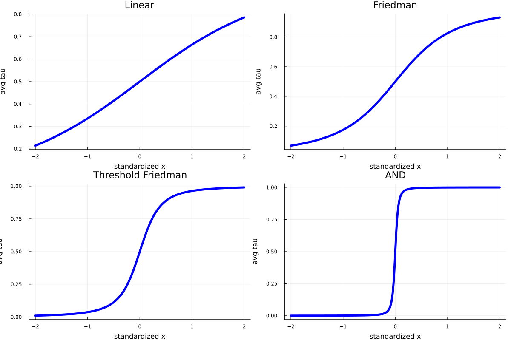

## Plotting and printing τ values 

**Summary**

- Simulates a dataset from four different functions.
- For each dataset, plots the average (across features) value of τ (weighted by importance).
- For a specific function, prints a detailed breakdown to screen   

**Main points**

- The average tau across all features provides a rough estimate of the overall smoothness of f(x),
  and therefore of the expected gains from HTBoost.
- The function may be considerably more nonlinear than what plots of a single value of tau may imply!
  Average values of tau mostly provide a guide to the gains that can be obtained by HTBoost:
  to gauge the nonlinearity of the function, these numbers should be supplemented by partial effect plots. 

---
---

Import HTBoost and other required packages

```julia
number_workers  = 8  # desired number of workers

using Distributed
nprocs()<number_workers ? addprocs( number_workers - nprocs()  ) : addprocs(0)
@everywhere using HybridTreeBoosting

using Random,Plots 

# USER'S OPTIONS 

```

Specify some user's options
```julia

# dgp: four increasingly irregular functions
dgp_a = ["Linear","Friedman","Threshold Friedman","AND"] 
which_function = 3                                     # for which function to print detailed break-down 

# Some options for HTBoost
loss      = :L2         
modality  = :fast     # :accurate, :compromise (default), :fast, :fastest 

priortype = :hybrid       # :hybrid (default) or :smooth to force smoothness 
nfold     = 1             # number of cv folds. 1 faster (single validation sets), default 4 is slower, but more accurate.
nofullsample = true       # if nfold=1 and nofullsample=true, the model is not re-fitted on the full sample after validation of the number of trees

randomizecv = false       # false (default) to use block-cv. 
verbose     = :Off
warnings    = :Off
 
# options to generate data. y = sum of six additive nonlinear functions + Gaussian noise.
n,n_test  = 10_000,100_000
stde      = 1.0
rndseed   = 1234

```

Four functions, increasingly irregular (from linearity to sharp splits)

```julia 
function simulatedata(n,stde;rndseed=1,dgp="Friedman")
    
    Random.seed!(rndseed)

    if dgp=="Linear"
        p = 5
        x = randn(n,p)
        f = x[:,1] + x[:,2] + x[:,3] + x[:,4] + x[:,5]
        y = f + stde*randn(n)   
    elseif dgp=="Friedman"
        p = 5
        x     = rand(n,p)  # for Friedman function x is uniform
        f = 10.0*sin.(π*x[:,1].*x[:,2]) + 20.0*(x[:,3].-0.5).^2 + 10.0*x[:,4] + 5.0*x[:,5]
        y = f + stde*randn(n)
    elseif dgp=="Threshold Friedman"
        p = 6
        x = rand(n,p)  # for Friedman function x is uniform
        f1 = 10.0*sin.(π*x[:,1].*x[:,2]) + 20.0*(x[:,3].-0.5).^2 + 10.0*x[:,4] + 5.0*x[:,5]
        f2 = 0.5*f1
        f  = f1.*(x[:,6].<0.5) + f2.*(x[:,6].>0.5)
        y = f + stde*randn(n)
    elseif dgp=="AND"
        p = 3
        x = randn(n,p)
        f = 10*( (x[:,1].>0.3).*(x[:,2].>0.3).*(x[:,3].>0.3) )   # same threshold: symmetric trees outperform     
        y = f + stde*randn(n) 
    end 

    return y,x,f 

end 

```

For each function, generate a dataset, fit HTBoost, store output

```julia 

output_a = Vector(undef,length(dgp_a))

for (i,dgp) in enumerate(dgp_a)

    y,x,f             = simulatedata(n,stde,rndseed=rndseed,dgp=dgp)
    y_test,x_test,f_test = simulatedata(100_000,stde,rndseed=rndseed,dgp=dgp)

    param  = HTBparam(loss=loss,priortype=priortype,randomizecv=randomizecv,nfold=nfold,verbose=verbose,warnings=warnings,
                modality=modality,nofullsample=nofullsample)

    data   = HTBdata(y,x,param)
    output = HTBfit(data,param)
    output_a[i] = output

end

```

Plotting average values for each function

```julia

pl   = Vector(undef,length(dgp_a))

for i in eachindex(dgp_a)

    avgtau,gavgtau,avgtau_a,dftau,x_plot,g_plot = HTBweightedtau(output_a[i],data,verbose=false,best_model=false);

    pl[i]   = plot( x_plot,g_plot,
           title =  dgp_a[i],
           legend = :bottomright,
           linecolor = [:blue],
           linestyle = [:solid],

           linewidth = [5],
           titlefont = font(15),
           legendfont = font(12),
           xlabel="standardized x",
           ylabel="avg tau",
           label=:none,
           )           
end

display(plot(pl[1],pl[2],pl[3],pl[4],layout=(2,2), size=(1200,800)))  

```

While the actual function will typically be more nonlinear than implied by these plots, we do get a useful estimate of whether HTBoost is using smooth or quasi-hard (or hard) splits, and therefore of the efficiency gains that can be expected. 

 


Printing a more detailed break-down for a specific function (here Threshold Friedman)

```julia
avgtau,gavgtau,avgtau_a,dftau,x_plot,g_plot = HTBweightedtau(output_a[which_function],data_a[which_function],verbose=true,best_model=false);
```
Notice how x6, which operates a hard split, has a high avg tau, x1,x2,x3, which enter nonlinearly, have average values of tau, and x4 and x5, which enter linearly, have small values.

```markdown

Row │ feature  importance  avgtau     sorted_feature  sorted_importance  sorted_avgtau 
     │ String   Float32     Float64    String          Float32            Float64       
─────┼──────────────────────────────────────────────────────────────────────────────────
─────┼──────────────────────────────────────────────────────────────────────────────────
─────┼──────────────────────────────────────────────────────────────────────────────────
   1 │ x1         15.4995    3.17203   x6                       30.5483       38.58
   2 │ x2         15.655     3.20808   x4                       19.1541        0.669109
   3 │ x3          9.6912    7.06228   x2                       15.655         3.20808
   4 │ x4         19.1541    0.669109  x1                       15.4995        3.17203
   5 │ x5          9.45188   0.994279  x3                        9.6912        7.06228
   6 │ x6         30.5483   38.58      x5                        9.45188       0.994279

 Average smoothing parameter τ is 4.9.

 In sufficiently large samples, and if modality=:compromise or :accurate

 - Values above 20-25 suggest little smoothness in important features. HTBoost's performance may slightly outperform or slightly underperform other gradient boosting machines.
 - At 10-15 or lower, HTBoost should outperform other gradient boosting machines, or at least be worth including in an ensemble.
 - At 5-7 or lower, HTBoost should strongly outperform other gradient boosting machines.

```